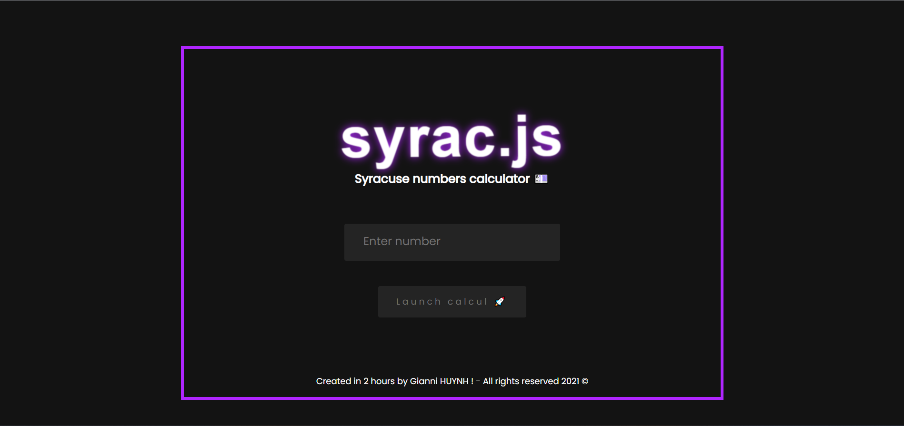

# syrac.js

<h1>Source code of an simple Collatz conjecture calculator ! 🚀</h1>
<h3>This project is just an personnal challenge, i had 2 hours for making that so it's minimalist but 100% working !</h3>
<h2>Screenshot</h2>

<h2>Link</h2>

https://giannihuynh.github.io/syrac.js/#

